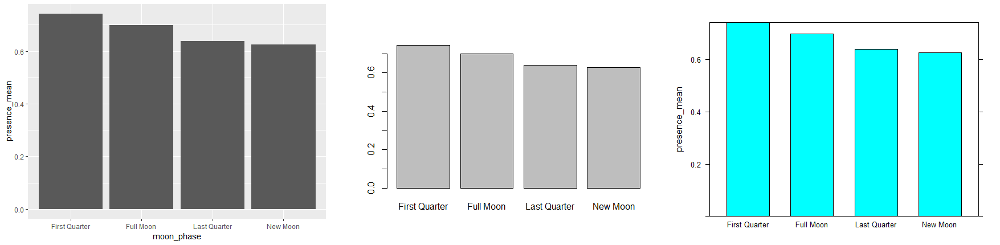
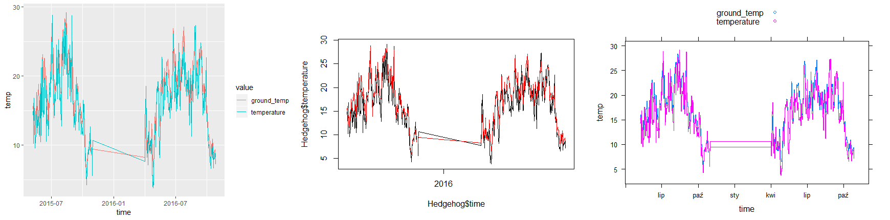
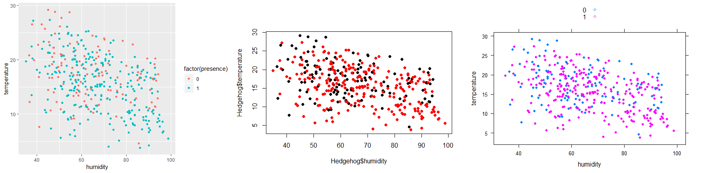
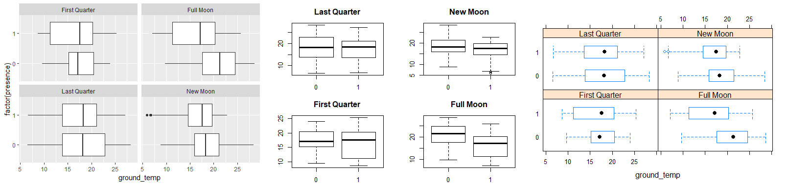
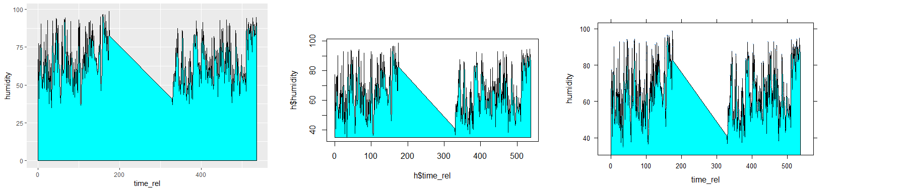

```{r setup, include=FALSE}
knitr::opts_chunk$set(echo = TRUE)
library(ggplot2)
library(lattice)
library(latticeExtra)
library(graphics)
library(LM2GLMM)
library(dplyr)
library(microbenchmark)
# head(Hedgehog)
```

"Hej, Agnieszka, robimy z koleżankami piżamówkę jutro z rana, wpadniesz?"

"Gigi, napijemy się? Świętuję oblanie jubileuszowego, dziesiątego przedmiotu."

"Cześć! Urządzamy premierowy pokaz szamponu na porost paznokci w parku Arkadia. Liczymy na Twoją obecność!"

Gigi westchnęła. Czuła, jak setki okazji przeciekają jej między palcami. Próbowała ściskać pięści, lecz okazje spływały jej po prostu po kłykciach. Podkładała drugą dłoń pod pierwszą, ale skutkowało to jedynie podwojeniem liczby przeciekających rąk. Sytuacja była beznadziejna.

A wszystko za sprawą zbyt długo generujących się wykresów.

Nagły, agresywny ping przychodzącej wiadomości zaskoczył Agnieszkę. Nim ta zdążyła zareagować, ugryzł ją w ucho i uciekł przez uchylone drzwi. Gigi nie miała zamiaru uganiać się za pingiem, wszystkie poprzednie chowały się gdzieś, gdzie nie mogła ich dostać, i z tym z pewnością byłoby nie inaczej. Zanotowała jedynie w pamięci, aby rozważyć zmianę sygnału powiadomienia o przychodzącej wiadomości na bardziej przyjazny dla ucha.

Ekran smartfonu jarzył się upiornie bladozielonym światłem. Gigi stuknęła palcem wyświetlacz, na co telefon zareagował porzuceniem poprzedniej poświaty na rzecz obrazu ekranu głównego. Nowo otrzymana wiadomość brzmiała: "Wysłaliśmy wiadomość. Powinna być w skrzynce". Agnieszka otworzyła okno, lecz na parapecie nie było niczego, nawet malutkiej zwłaszczy.

Miała już wycofać ostatnio wykonaną operację, gdy usłyszała pełne żałości gruchanie. Rozejrzała się po oknie i dostrzegła siedzącego na nim gołębia. Krótkodystansowego gołębia mailowego. Po odczytaniu treści i nadawcy z głowy gołębia wpuściła go do mieszkania i przystąpiła do czytania zawartości. Treść była krótka:

"Gigi, od dwóch tygodni nie ma cię na zajęciach. Przyjdziemy z alko do ciebie."

Agnieszka zamknęła ciało gołębia i zostawiła na stercie gołębi mailowych z ostatnich trzech lat. Raz na pół roku archiwizowała najstarsze gołębie, by uniknąć przepełnienia. Następnie udała się zabarykadować drzwi przy użyciu klucza.

***

Spodziewała się stukania do drzwi.

– Gigi, jesteś tam? – odezwało się stukanie.

Agnieszka odłączyła głośno szumiący wentylator i zjechała nieznacznie na siedzisku fotela, choć i tak nikt nie mógł jej dostrzec przez dziurę do klucza bądź judasza dla gości. Czas uciekał, musiała więc zoptymalizować metodę tworzenia wykresów.

Jej rozbiegany wzrok padł na karteczki motywacyjne, których wciąż nie sprzątnęła po poprzednim lokatorze. "Bądź sobą" nie brzmiało zbyt pomocnie, "Staw czoła wyzwaniu" też nie było rozsądnym wyjściem, gdy wyzwanie oczekiwało za drzwiami. Obiecująco zabrzmiało natomiast "Próbuj różnych rozwiązań". Gigi spojrzała na listę bibliotek do tworzenia wykresów i doznała olśnienia.

– Gigi? – zapytały stukania w dwugłosie.

Agnieszka rozprostowała palce, zgięła i rozprostowała ponownie, a następnie przystąpiła do kodowania. Zaczęła od załadowania biblioteki z jej ulubionym zbiorem danych:

```{r, eval=FALSE}
library(LM2GLMM)
attach(Hedgehog)
```

Natychmiast poprawiła się jednak:

```{r, eval=FALSE}
detach(Hedgehog)
```

Biblioteki do tworzenia grafik załadowane miała od tygodni. Szybko wyklikała podstawowe wykresy słupkowe obrazujące częstość zaobserwowań jeży w zależności od fazy księżyca:

```{r, fig.keep='none'}
h <- Hedgehog %>%
  group_by(moon_phase) %>%
  summarise(presence_mean = mean(presence))
(b1 <- microbenchmark(
  gg = {
    ggplot(h, aes(moon_phase, presence_mean)) +
      geom_bar(stat = "identity")
  },
  gph = {
    barplot(h$presence_mean, names.arg = h$moon_phase)
  },
  lat = {
    barchart(presence_mean ~ moon_phase, h, ylim = c(0, max(h$presence_mean)))
  },
  times = 10L
))
```



Gigi pufnęła z satysfakcją. Dokładnie tego potrzebowała. Pomyślała jednak, że to może być cecha wykresów słupkowych, zaczęła więc z zaciętością stanowiącą około 76.3 procent poprzedniej zaciętości wystukiwać kody kolejnych wykresów.

W pewnym momencie coś uderzyło o coś, coś chrobotnęło i nastała cisza, by za moment ponownie uderzyć, ponownie chrobotnąć i boleśnie zakwiczeć. To znajomi Agnieszki próbowali sforsować drzwi, aby zanieść jej alkohol. Szczęśliwie, przy wyborze drzwi jednym z kluczowych kryteriów wyboru była ich odporność na próby sforsowania przez znajomych niosących alkohol.

Gigi nawet nie spojrzała w tamtym kierunku, zwłaszcza że na linii widoku stały dwie ściany, jedna szafka narożna oraz pluszowy pomnik Jeża. Była zbyt zajęta sprawdzaniem innych wykresów.

```{r, fig.keep='none'}
h <- data.frame(time = rep(Hedgehog$time, 2),
                temp = c(Hedgehog$temperature, Hedgehog$ground_temp),
                value = rep(c("temperature", "ground_temp"), each = nrow(Hedgehog)))
(b2 <- microbenchmark(
  gg = {
    ggplot(h, aes(time, temp, colour = value)) +
      geom_line()
  },
  gph = {
    plot(Hedgehog$time, Hedgehog$temperature, type = "l")
    lines(Hedgehog$time, Hedgehog$ground_temp, col = "red")
  },
  lat = {
    xyplot(temp ~ time, h, groups = value, type = "s", auto.key = list())
  },
  times = 10L
))
```



– Znów... – stwierdziła cicho.

– Do kroćset, laska! – słychać było przytłumione zza drzwi – Znowu odpierdalasz? I tak tu wejdziemy. – Po tych słowach uderzenia powróciły ze zdwojoną siłą. Agnieszka usiłowała robić swoje, lecz odczuwała swoisty wewnętrzny niepokój. Nie wiedziała wszak, jak wiele drzwi są w stanie wytrzymać.

Jak na zawołanie, drzwi zajęczały zawiasami oraz wszystkim tym, co sprawia, że drzwi są drzwiami, a nie zbiorem kilku luźnych desek. Gigi zajęczała również. W odpowiedzi drzwi zajęczały ponownie, trochę przeciągle, z pytającą i nieco sarkastyczną intonacją. Gigi odpowiedziała krótkim, ostrym jękiem i strzeliła focha, przestając odpowiadać na dalsze jęczące zaczepki. Zamiast tego dokończyła kod trzeciego porównania.

```{r, fig.keep='none'}
(b3 <- microbenchmark(
  gg = {
    ggplot(Hedgehog, aes(humidity, temperature, colour = factor(presence))) +
      geom_point()
  },
  gph = {
    plot(Hedgehog$humidity, Hedgehog$temperature, col = factor(Hedgehog$presence), pch = 19)
  },
  lat = {
    xyplot(temperature ~ humidity, Hedgehog, groups = factor(presence), pch = 19, auto.key = list())
  },
  times = 10L
))
```



"To za mało", pomyślał Stirlitz.

– To za mało – powiedziała Agnieszka. Równocześnie ustały jęki i łomotania.

– Czego za mało? – dobiegło zza drzwi.

– Wykresów! – odpowiedziała, podnosząc głos.

– Czegoś jeszcze?

– Ser się skończył... i mleko. Dwuprocentowe – dodała.

– Jasne!

Gigi usłyszała kroki zbiegających na dół znajomych, po czym udała się do kuchni. Westchnęła, otworzywszy lodówkę i omiótłszy ją spojrzeniem. Zapomniała wspomnieć o majonezie. No nic, jakoś sobie poradzi. Wyjęła jeszcze zgrzewkę jogurtów i otworzyła jedną puszkę. Jogurt o smaku śliwki, rabarbaru, liści klonu, wojny klonów i niedopałków, które przypadkiem dostały się do kotła na etapie produkcji, zasyczał smakowicie. Dziewczyna wychyliła duszkiem siedem dwudziestych szóstych puszki i poczuła, jak przyjemny żar niedogaszonego niedopałka rozgrzewa jej trzewia. Pociągnęła jeszcze jeden łyk i odstawiła jogurt.

Wracając do swojej komnaty, spojrzała w oczy Pluszowego Jeża i poczuła nieokreślony niepokój. Gigi wiedziała, co to oznacza, i wzdrygnęła się. Istnieją wektory $x$, takie że niepokój może przyjąć wartości zarówno dodatnie, jak i ujemne! Poczuła, że nie jest w stanie iść dalej.

***

Gdyby nie dzwonek do drzwi, Agnieszka stałaby tak jeszcze długo. Otrząsnęła się jednak i otworzyła drzwi. Jej znajomi stali na wycieraczce, stłoczeni, trzymając w rękach sery, mleko i alkohol. Wręczyli jej pierwsze dwa produkty, na co Gigi odpowiedziała podziękowalnym dygnięciem i zamknęła drzwi, ponownie ryglując je kluczem. Zdążyła tylko odstawić zakupy do lodówki, gdy ponownie rozpoczęły się dobijania i trzaski.

Agnieszka wiedziała, że nie uda jej się przeczekać tego szturmu. Widziała tylko jedno rozwiązanie, które dawało jej czas – poprosić o pomoc Pluszowego Jeża. Uklęknęła przed pluszowym pomnikiem, następnie przykucnęła, wykręciła nogę, aż wreszcie zamarła w pozycji przypominającej odwrócony siad koszykarski skrzyżowany z pozycją kota przyczajonego przed atakiem na złotą rybkę i zaczęła prośby:

– O, Pluszowy Jeżu Boru Wszechlistnego, który za dnia strząsasz siłą swojego jestestwa owoce jabłoni naszych, a nocą tuptasz niezbadanymi ścieżkami! Jeżu, którego kolce są najstraszliwszym orężem na nieprzyjacioły nasze, wysłuchaj moich błagań! – Gigi zamilkła, szukając słów. Wreszcie kontynuowała: – Spraw, aby drzwi moje stały się murem, ktorego nie sposób pokonać. I... i niechaj nikt...

Dalsze słowa dziewczyny zostały zagłuszone przez świst przeciągu. Agnieszka poderwała się z podłogi i obróciła w kierunku drzwi wejściowych, a przynajmniej miejsca, w którym te drzwi kiedyś stały. Teraz stał tam mniej więcej metrowy mur, uzbrojony od góry w kolce i rogi jednorożców. Błyszczał, jak gdyby pokryty był jakąś śliską mazią.

– Co, do jasnej?... – odezwał się głos z drugiej strony bariery.

– Co?... Dlaczego?... – odparła skonsternowana Agnieszka.

– Jesteśmy skonfundowani – usłyszała odpowiedź.

– Ja również – przyznała. – Co teraz?

Po chwili zakłopotanego milczenia współrozmówca odparł:

– To może my już pójdziemy?

– Nie, czekajcie, to byłaby beznadziejna puenta historii – zaniepokoiła się Gigi. – Otworzę drzwi na balkon, a wy coś wymyślcie. Może zejdźcie z piętra wyżej.

– Ej, dobre, dzięki! – usłyszała, po czym zabrzmiały kroki na schodach.

Dziewczyna otworzyła drzwi na balkon i wróciła do pokoju. Straciła trochę cennego czasu, a nadal nie osiągnęła celu.

```{r, fig.keep='none'}
(b4 <- microbenchmark(
  gg = {
    ggplot(Hedgehog, aes(factor(presence), ground_temp)) +
      geom_boxplot() +
      facet_wrap(~moon_phase) +
      coord_flip()
  },
  gph = {
    par(mfrow = c(2, 2))
    # par(mar = c(2.1, 3.1, 3.1, 2.1))
    boxplot(ground_temp ~ presence, data = filter(Hedgehog, moon_phase == "Last Quarter"), main = "Last Quarter")
    boxplot(ground_temp ~ presence, data = filter(Hedgehog, moon_phase == "New Moon"), main = "New Moon")
    boxplot(ground_temp ~ presence, data = filter(Hedgehog, moon_phase == "First Quarter"), main = "First Quarter")
    boxplot(ground_temp ~ presence, data = filter(Hedgehog, moon_phase == "Full Moon"), main = "Full Moon")
  },
  lat = {
    bwplot(factor(presence) ~ ground_temp | moon_phase, Hedgehog)
  },
  times = 10L
))
```



"Jeszcze jedno i pozbędę się wątpliwości", pomyślała Gigi i zaczęła pisanie kolejnego, ostatniego porównania.

Nie dotarła jednak do połowy, gdy rozległ się brzęk tłuczonego szkła.

– Motyla noga! – nie rozległo się, ponieważ intruz użył znacznie mocniejszych słów.

– Do diaska, łamago, masz dziurawe ręce czy co? – skomentował grubszy, bardziej basowy głos.

– Nieważne, nie ładujcie się za mną! – odparł intruz.

– Co nie ładujcie, no chyba, że tam zejdziemy!

Agnieszka przysłuchiwała się temu z ambiwalentnym stosunkiem. Z jednej strony dręczył ją niepokój, gdyż nie zapowiadało się, że dokończy kod, z drugiej strony zaś historia rozwijała się poprawnie, co dawało nadzieję na sensowne zakończenie.

Drzwi do jej komnaty uchyliły się bezgłośnie, gdyż, w przeciwieństwie do wielu innych, były dobrze naoliwione, nasmarowane i obtoczone w tłuszczu. W ślad za dłonią, która uchyliła drzwi, podążył nadgarstek, przedramię, łokieć i reszta ręki, po czym w podobnym trybie dołączyła druga ręka. Gdy to samo zaczęła czynić lewa noga, Agnieszka nie była już w stanie oderwać wzroku od tego osobliwego przedstawienia. Nim przemknęło jej to przez myśl, lewa noga dołączyła do rąk, które już rozglądały się ciekawsko po nowym dla nich pomieszczeniu, a proces wchodzenia zaczęła prawa noga.

– Hej, a grawitacja? – zakrzyknęła Gigi.

Rozległo się głuche łupnięcie, a następnie głos odpowiedział:

– *Dammit*, musiałaś przypominać?

Agnieszka zrobiła w odpowiedzi nieokreśloną minę, która miała wyrażać jednocześnie skruchę, jej brak, satysfakcję i wstyd. Nie było to łatwe, dlatego mina wyrażała bardziej wewnętrzną emocjonalną niespójność dziewczyny. Wreszcie intruz podniósł się i w tradycyjny sposób wkroczył do pokoju.

– Co to za cyrki, Hubert?

– Przynieśliśmy ci flaszkę. - Hubert spojrzał gdzieś w bok. – Właściwie dwie, ale druga leży w kawałkach gdzieś na trawniku pod balkonem. *Sorry*. Co robisz? – zmienił temat.

Dziewczyna westchnęła. Nie mogła uciec od tego pytania.

– Pracuję – odrzekła szorstko.

– Weź, laska, wyluzuj i chodź z nami – rzucił Hubert. – No chyba nie powiesz, że... – urwał, zapatrzywszy się w ekran.

Zaskoczona Gigi nie wiedziała, co powiedzieć, rzuciła się więc w poszukiwaniu swojego egzemplarza "Rozmówek polsko-znajomych", który leżał gdzieś na półce, czekając na taką okazję. Chłopak odezwał się jednak pierwszy:

– Rysujesz wykresy w R? – zapytał i, nie czekając na odpowiedź, kontynuował: – I co, którą bibliotekę lubisz najbardziej? A co z ggvis, nie używasz? Nie, czekaj, nie mów, nie potrzebowałaś niczego interaktywnego, *right*? Nie, w ogóle, to daj fotel. – Rozejrzał się w poszukiwaniu siedzenia, a, gdy już je zlokalizował, przysunął je pod siebie. – Daj, dokończę. Popatrzmy... robisz *area chart* w lattice? Czekaj, to jakoś tak było...

Gigi patrzyła, a uśmiech lekkiego niedowierzania wypełzał na jej usta. Zaczynała się domyślać, co się dzieje.

– Okej, powinno być – oznajmił Hubert. – Czekaj, odpalę.

```{r, fig.keep='none'}
h <- Hedgehog %>%
  mutate(humidity = ifelse(is.na(humidity), mean(humidity, na.rm = TRUE), humidity))
(b5 <- microbenchmark(
  gg = {
    ggplot(h, aes(time_rel, humidity)) +
      geom_area(fill = "cyan", col = "black")
  },
  gph = {
    plot(h$time_rel, h$humidity, type = "l")
    polygon(
      c(min(h$time_rel), h$time_rel, max(h$time_rel)),
      c(min(h$humidity), h$humidity, min(h$humidity)),
      col = "cyan"
    )
  },
  lat = {
    xyplot(humidity ~ time_rel, h, pch = ".",
           panel = function(x, y, ...) {
             panel.xyarea(x, y, ...)
             panel.xyplot(x, y, ...)})
  },
  times = 10L
))
```



– Co dalej? – zapytał.

A więc Jeż usłyszał jej drugie życzenie. Teraz nikt nie mógł oprzeć się magii R.

– Tyle – stwierdziła z uśmiechem Agnieszka. – Chciałam z tym zdążyć przed waszym przyjściem. Zawołam pozostałych i pójdziemy razem. – Obróciła się na pięcie i poszła przyjmować zeskakujących z balkonu znajomych. Przekonująco tłumacząc problemy związane z próbą opuszczenia mieszkania po kolejnych balkonach bądź drzwiami wejściowymi, dziewczyna powiodła znajomych do pokoju, gdzie Hubert bez pamięci stukał w klawisze.

***

– Zrobimy to dplyrem! – krzyczał ktoś.

– Nie, bo data table'em! – odpowiadał inny.

– Funkcje bazowe! – rzucał ktoś, ale natychmiast spotykał się ze zgodnym ostracyzmem.

Gigi przyglądała się temu z założonymi rękami i szerokim uśmiechem.

– Cały ten tidyverse to... – przerwano komuś.

Jednak nagła myśl starła Agnieszce uśmiech z twarzy.

"Teraz na pewno nie dokończę wykresów!"
