```{r setup, include=FALSE}
knitr::opts_chunk$set(echo = TRUE)
library("pander")
library("dplyr")
library("ggplot2")
```

```{r show_table, echo=FALSE, cache=TRUE}
show_table <- function(file_name) {
  df <- read.csv(file_name)
  knitr::kable(df)
}
```

# Zbiór danych
Do wygenerowania wykresów został użyty zbiór `maturaExam` z pakietu `SmarterPoland`.
Ów zbiór zawiera dane dotyczące wyników matury z języka polskiego i matematyki.

W niniejszej pracy zajęłam się danymi dotyczącymi wyników z matury z matematyki.
Kolejne wykresy bazowały na danych przetworzonych w następujący sposób:

1. *BoxPlot*: Wszystkie wyniki z matury z matematyki w latach 2010-2015

2. *BarPlot*: Średnia punktów z matury z matematyki dla każdego roku (2010-2015)

3. *PointPlot*: Wszystkie wyniki z matury z matematyki w latach 2010-2015

4. *Histogram*: Wszystkie wyniki z matury z matematyki dla roku 2014

5. *DensityPlot*: Wszystkie wyniki z matury z matematyki dla roku 2014

# Otrzymane wykresy

Otrzymałam następujące wykresy:

## BoxPlot
### ggplot2
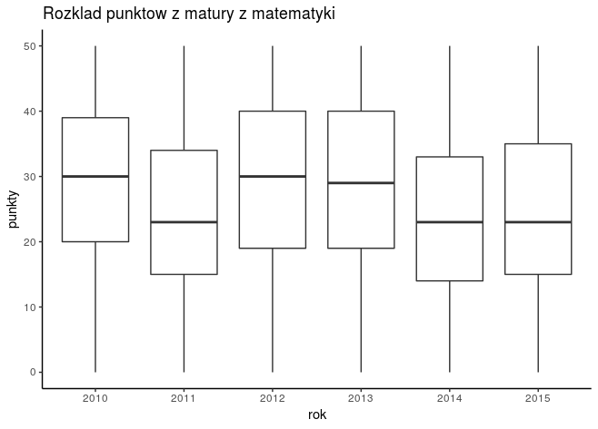

### lattice

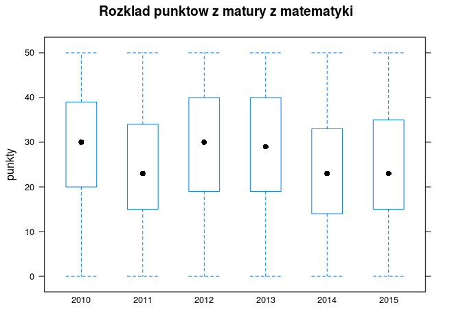

### graphics

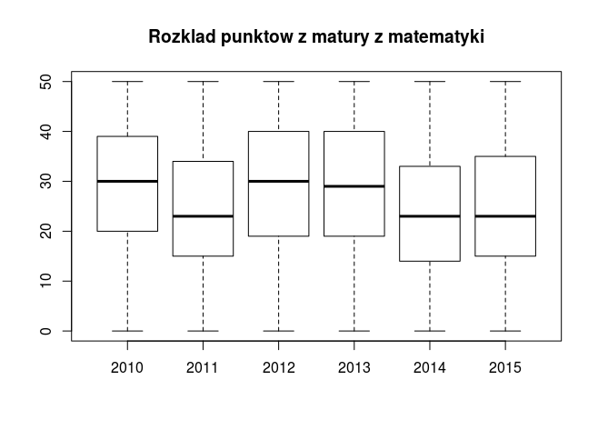

### Porównanie szybkości generowania wykresów [ms]

```{r, dependson=show_table, echo=FALSE}
show_table("benchmark_results/box_plot.csv")
```

## BarPlot

### ggplot2

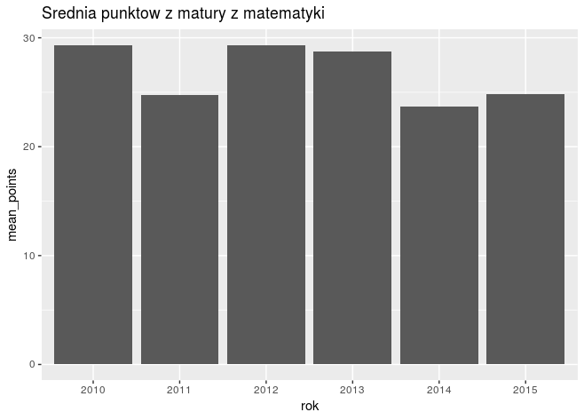

### lattice

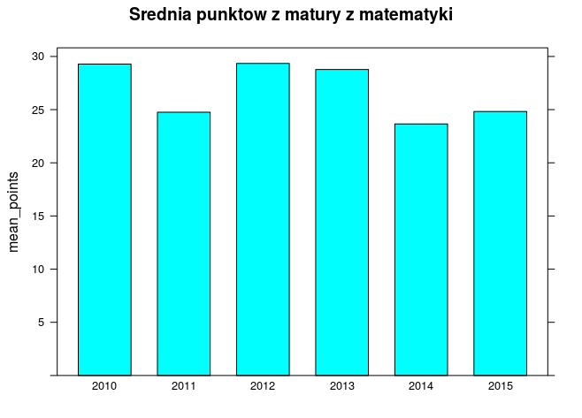

### graphics

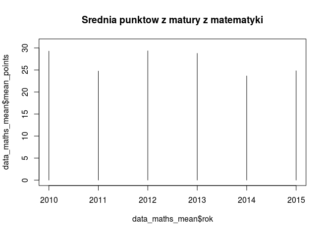

### Porównanie szybkości generowania wykresów [ms]

```{r, dependson=show_table, echo=FALSE}
show_table("benchmark_results/bar_plot.csv")
```

## PointPlot
Poniższe trzy wykresy nie są czytelne, jednakże celem zadania było zbadanie wydajności
generowania wykresu przez trzy różne biblioteki.

### ggplot2

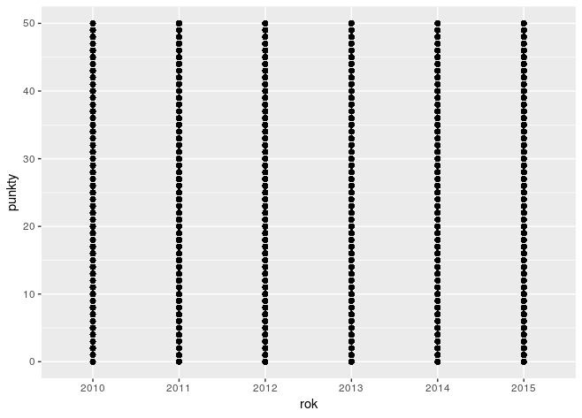

### lattice

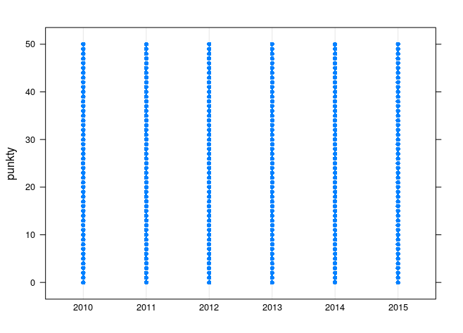

### graphics

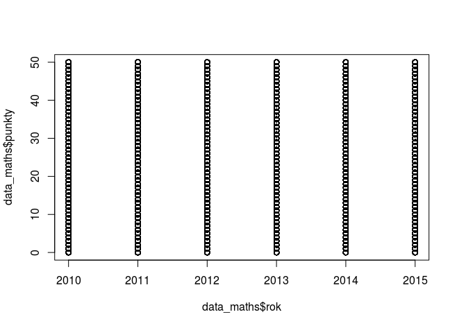

### Porównanie szybkości generowania wykresów [ms]

```{r, dependson=show_table, echo=FALSE}
show_table("benchmark_results/point_plot.csv")
```

## Histogram

### ggplot2

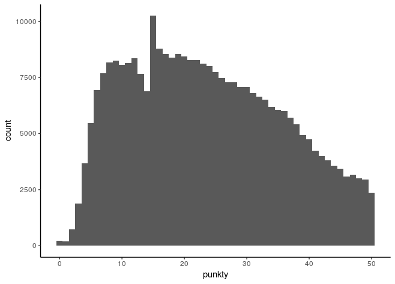

### lattice

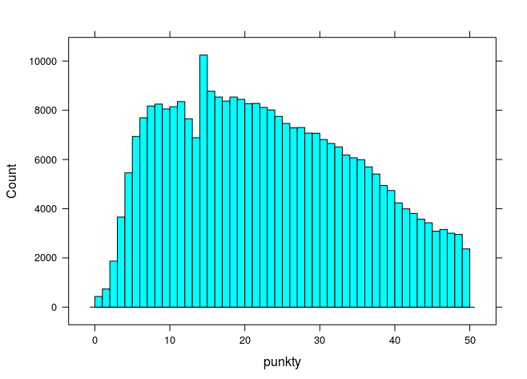

### graphics

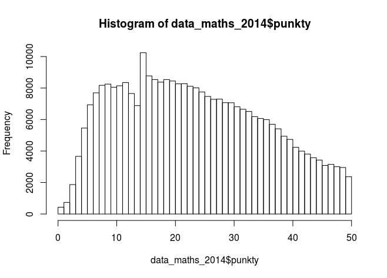

### Porównanie szybkości generowania wykresów [ms]

```{r, dependson=show_table, echo=FALSE}
show_table("benchmark_results/histogram.csv")
```

## DensityPlot

### ggplot2

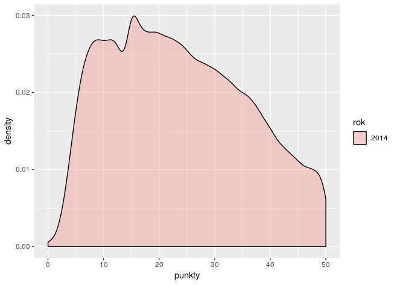

### lattice

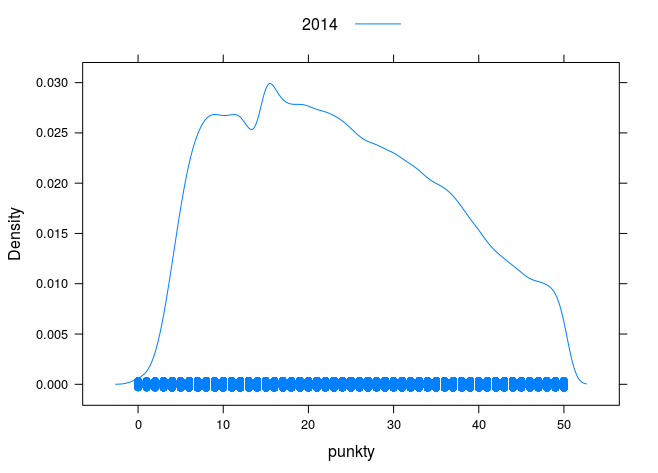

### graphics

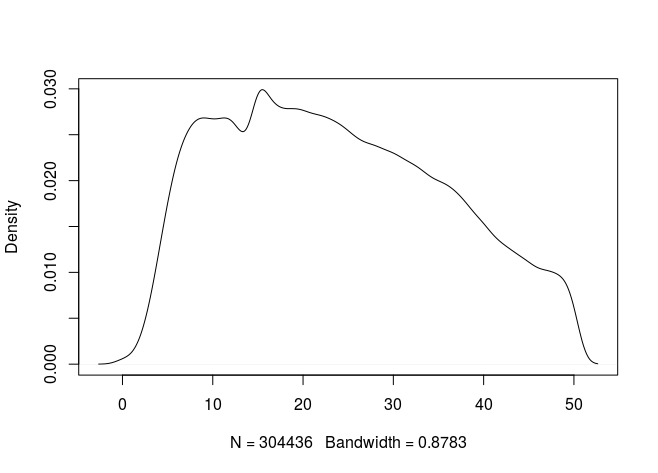

### Porównanie szybkości generowania wykresów [ms]

```{r, dependson=show_table, echo=FALSE}
show_table("benchmark_results/density_plot.csv")
```

# Podsumowanie
Wyniki zbiorcze prezentują się następująco:

```{r all_results, echo=FALSE}
plot_names <- c(
  "box_plot",
  "bar_plot",
  "point_plot",
  "histogram",
  "density_plot"
)

package_names <- c("ggplot", "lattice", "graphics")

get_package_benchmark <- function(package_name) {
  read.csv(sprintf("benchmark_results/%s.csv", package_name)) %>% select("mean")
}

benchmark_res <- cbind(
  data.frame(package=package_names),
  Reduce(cbind, lapply(plot_names, get_package_benchmark)))

colnames(benchmark_res) <- c("package", plot_names)
knitr::kable(benchmark_res)
```

Wyniki zostały przedstawione na poniższych dwóch wykresach:

```{r, echo=FALSE}

show_summary_bar_chart <- function(data) {
  data %>% 
    ggplot(aes(x=plot, y=mean, group=package, fill=package, label=round(mean,2))) + 
    geom_bar(stat='identity', position=position_dodge(1)) +
    ylab("mean [ms]") +
    theme_classic()
}
```

```{r, echo=FALSE, out.width="700px", out.align="center"}
plot_final_data <- Reduce(
  rbind,
  lapply(
    plot_names,
    function(r) get_package_benchmark(r) %>% cbind(data.frame(package=as.factor(package_names), plot=r))))

first_plot_final_data <- plot_final_data %>% 
  filter(plot != "histogram" & plot != "bar_plot" & plot != "density_plot")

show_summary_bar_chart(first_plot_final_data)
```

```{r, echo=FALSE, out.width="700px", out.align="center"}
second_plot_final_data <- plot_final_data %>% 
  filter(plot == "histogram" | plot == "bar_plot" | plot == "density_plot")

show_summary_bar_chart(second_plot_final_data)
```

Podsumowując, stwierdzam, że w znaczącej liczbie przypadków pakiet `graphics` jest najszybszy.