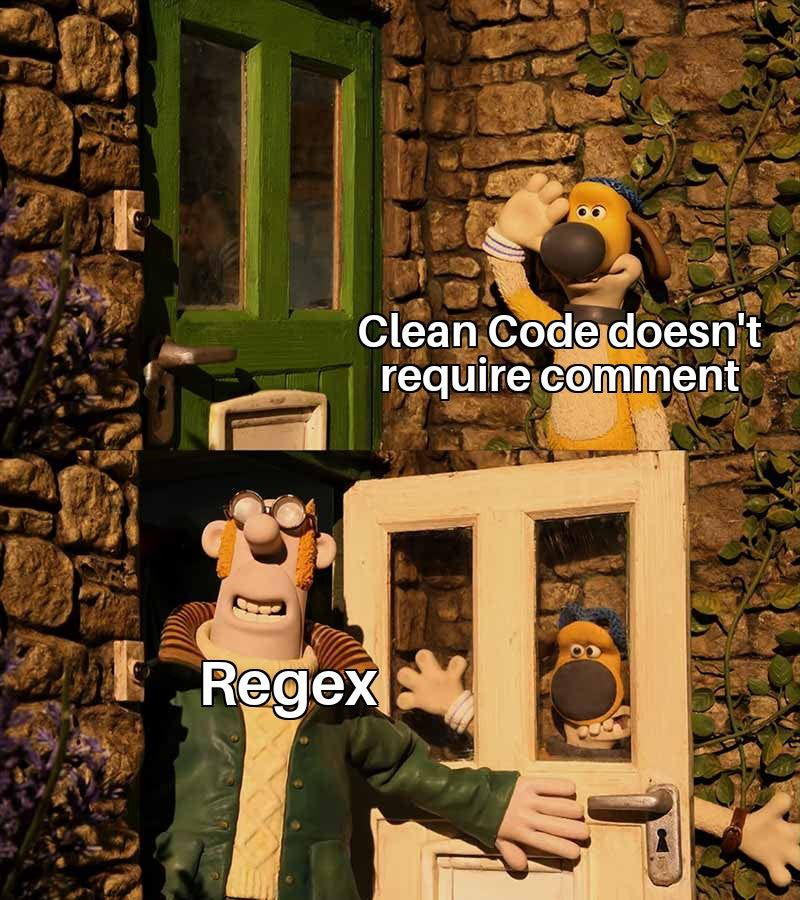

```{r setup, include=FALSE}
knitr::opts_chunk$set(echo = TRUE)
library(rex)
```

## Regexy są (nie) dla ludzi

Liczba przecinkowa:
```{r print1, echo = FALSE}
as.character(
  
  rex(
    start,
    maybe(one_of("+", "-")),
    one_or_more(digit),
    maybe("."),
    zero_or_more(digit),
    end
  )
)
```
Nazwa zmiennej w R:
```{r print2, echo = FALSE}
as.character(
  rex(
    start,
    or(letter,  "." %if_next_isnt% digit),
    any_of(alnum, "_", "."),
    end
    )
  )
```
Adres e-mail :
```{r print3, echo = FALSE}
# ^((\w+([-+.]\w+)*@\w+([-.]\w+)*\.\w+([-.]\w+)*)\s*[;]{0,1}\s*)+$
as.character(
  rex(
    start,
    some_of(alnum, "_"),
    zero_or_more(
      one_of("-", "+", "."),
      some_of(alnum, "_")),
    "@",
    some_of(alnum, "_"),
    zero_or_more(
      one_of("-", "."),
      some_of(alnum, "_")
    ),
    ".",
    some_of(alnum, "_"),
    zero_or_more(
      one_of("-", "."),
      some_of(alnum, "_")
    ),
    end
  )
)
```

## Użycie

```{r example_1}
###<b>
rex(
  ###</b>
  # Tu po kolei podajemy elementy naszego regexa
  "Mogę być",
  or(
    "stringiem",
    one_of("Z","b","i","o","r","e","m"),
    any_of(letter),
    some_of(digit))
)

```

## Słowniczek {.smaller}

|Regex| rex |
|:---:|:---:|
|.    |`any`|
|?    |`maybe()`|
|*    |`any_of()` / `zero_or_more()`|
|+    |`some_of()` / `one_or_more()`|
|[ ]  |`range()` / `one_of()`       |
|[^ ]            |`except_any_of()` / `except_some_of()` / `exclude_range()`|
| \|  |             `or()` / `%or%` |
|{n}   | `n_times()`, `between()`, `at_least()`, `at_most()`|
|^, $ |`start`, `end`|   

## Meta-characters {.smaller}

|Regex alias|PCRE| rex |
|:---:            |:---:|:---:|
|[A-Za-z0-9]|[[:alnum:]]|`alnum`|
|\\h        |[[:blank:]]|`blank`|
|\\d        |[[:digit:]]|`digit`|
|\\l        |[[:lower:]]|`lower`|
|\\u        |[[:upper:]]|`upper`|
|\\s        |[[:space:]]|`space`|
|\\w        |[[:word:]] |`one_of(alnum, "_")`|

```{r shortcuts, eval = FALSE}
names(shortcuts)
```

## Przykład 

Liczba przecinkowa:
```{r }
as.character(
  rex(
    ### <b>
    start,
    ###</b>
    maybe(one_of("+", "-")),
    some_of(digit),
    maybe("."),
    any_of(digit),
    end
  )
)
```
## Przykład 

Liczba przecinkowa:
```{r }
as.character(
  rex(
    start,
    ###<b>
    maybe(one_of("+", "-")),
     ###</b>
    some_of(digit),
    maybe("."),
    any_of(digit),
    end
  )
)
```

## Przykład 

Liczba przecinkowa:
```{r }
as.character(
  rex(
    start,
    maybe(one_of("+", "-")),
    ###<b>
    some_of(digit),
    ###</b>
    maybe("."),
    any_of(digit),
    end
  )
)
```

## Przykład 

Liczba przecinkowa:
```{r }
as.character(
  rex(
    start,
    maybe(one_of("+", "-")),
    some_of(digit),
    ###<b>
    maybe("."),
    ###</b>
    any_of(digit),
    end
  )
)
```


## Przykład 

Liczba przecinkowa:
```{r }
as.character(
  rex(
    start,
    maybe(one_of("+", "-")),
    some_of(digit),
    maybe("."),
    ###<b>
    any_of(digit),
    ###</b>
    end
  )
)
```

## Przykład 

Liczba przecinkowa:
```{r }
as.character(
  rex(
    start,
    maybe(one_of("+", "-")),
    some_of(digit),
    maybe("."),
    any_of(digit),
    ###<b>
    end
    ###</b>
  )
)
```


## Przykład

Nazwa zmiennej w R:
```{r}
as.character(
  rex(
    ###<b>
    start,
    ###</b>
    or(letter,  "." %if_next_isnt% digit),
    any_of(alnum, "_", "."),
    end
    )
  )
```

## Przykład

Nazwa zmiennej w R:
```{r}
as.character(
  rex(
    start,
    ###<b>
    or(letter,  "." %if_next_isnt% digit),
    ###</b>
    any_of(alnum, "_", "."),
    end
    )
  )
```

## Przykład

Nazwa zmiennej w R:
```{r}
as.character(
  rex(
    start,
    or(letter,  "." %if_next_isnt% digit),
    ###<b>
    any_of(alnum, "_", "."),
    ###</b>
    end
    )
  )
```

## Przykład

Nazwa zmiennej w R:
```{r}
as.character(
  rex(
    start,
    or(letter,  "." %if_next_isnt% digit),
    any_of(alnum, "_", "."),
    ###<b>
    end
    ###</b>
    )
  )
```


## Podsumowanie 

1. Wygodny sposób na tworzenie regexów
2. Łatwiejsze utrzymanie kodu

## Regexy są (już) dla ludzi {.hcenter .vcenter}
<div class="centered">


</div>