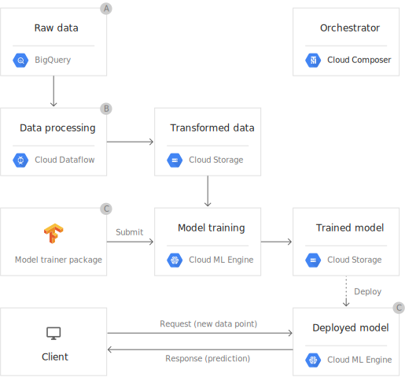

```{r setup, include=FALSE}
knitr::opts_chunk$set(echo = FALSE)
```

## R Markdown

This is an R Markdown presentation. Markdown is a simple formatting syntax for authoring HTML, PDF, and MS Word documents. For more details on using R Markdown see <http://rmarkdown.rstudio.com>.

When you click the **Knit** button a document will be generated that includes both content as well as the output of any embedded R code chunks within the document.

## Kiedy drake jest przydatny?

- du¿e zbiory danych
- skomplikowane zale¿noœci
- du¿e, czêste zmiany w danych wejœciowych

## Przetwarzanie du¿ych danych

<center>

</center>

## Skomplikowane zale¿noœci

<center>

</center>

## Zmiany w danych wejœciowych

<center>

</center>

## Zastosowania pakietu drake

- reprodukowalnoϾ
- budowanie grafów zale¿noœci
- optymalizacja przetwarzania

## ReprodukowalnoϾ

- spójnoœæ wewnêtrzna
- output zgodny z kodem i danymi
- odzyskiwanie danych

## ReprodukowalnoϾ

```{r r1}
library(ggplot2)
ggplot(data = iris, aes(x = Petal.Width, fill = Species)) +
    geom_histogram()
```

## ReprodukowalnoϾ

```{r r2}
library(ggplot2)
ggplot(data = iris, aes(x = Petal.Width, fill = Species)) +
    geom_histogram(binwidth = 0.25) +
    theme_gray(20)
```


## Grafy zale¿noœci

<center>
{
width=80% }
</center>

## Optymalizacja przetwarzania

- przetwarzanie tylko potrzebnych czêœci
- przetwarzanie równoleg³e

## Slide with R Output

```{r cars, echo = TRUE}
summary(cars)
```

## Slide with Plot

```{r pressure}
plot(pressure)
```


# Caption1

## Caption 2
