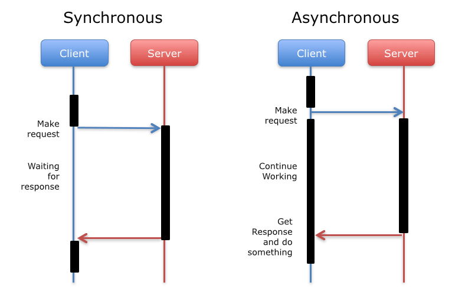

# Wprowadzenie

## Future - obliczenia asynchroniczne w R

{width=90%}

# Omówienie pakietu

## Sposoby zarządzania future'ów

|           Name  |  Description  |
|:-----------------:|:------------------------------------------------------------------:|
| **synchronous** | **non-parallel** |
| sequential	|	Sequentially and in the current R process |
| transparent	|	As sequential w/ early signaling and w/out local (for debugging) |
| | |
| **asynchronous**	|	**parallel** |
| multiprocess	|	Multicore, if supported, otherwise multisession |
| multisession	|	Background R sessions (on current machine) |
| multicore	|	Forked R processes (on current machine) |
| cluster	| External R sessions on current, local, and/or remote machines |
| remote	| Simple access to remote R sessions |

# Przykłady użycia

## Linijka po linijce w bazowym R

```{r}
pid <- Sys.getpid()
```

```{r echo=FALSE}
cat("PID przed operacjami: ", pid)
```

```{r}
a <- {pid <- Sys.getpid(); cat("Variable 'a' ...\n"); 3.14}
```

```{r}
b <- {rm(pid); cat("Variable 'b' ...\n"); Sys.getpid()}
b
a
```

```{r error=TRUE}   
cat("PID po operacjach:", pid)
```

## Synchronicznie, z użyciem *future*

```{r echo=FALSE}
library(future)
```

```{r error=TRUE, warning=FALSE}
plan(sequential)
pid <- Sys.getpid()
pid
a %<-% {pid <- Sys.getpid(); cat("Future 'a' ...\n"); 3.14}
b %<-% {rm(pid); cat("Future 'b' ...\n"); Sys.getpid()}
b
a
pid
```

## Asynchronicznie, z użyciem future

```{r error=FALSE, warning=FALSE}
plan(multisession)
pid <- Sys.getpid()
pid
a %<-% {pid <- Sys.getpid(); cat("Future 'a' ...\n"); 3.14}
b %<-% {rm(pid); cat("Future 'b' ...\n"); Sys.getpid()}
b
a
pid
```


## Demo i prosty przykład użycia

Użyty kod zostanie dołączony do przesłanej prezentacji.

# Zakończenie

## Zakończenie

Dziękujemy za uwagę.
\newline
\newline
Zapraszamy do repozytorium: github.com/HenrikBengtsson/future.
\newline
\newline
Prezentacja stworzona dzięki pakietowi *miniBeamer*.
\newline
\newline
Użyte dodatkowe źródła:

https://luminousmen.com/post/asynchronous-programming-await-the-future

